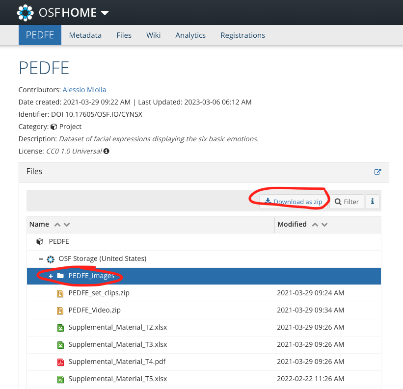

# smiles
Final project for CSCI3397. Detect fake vs. genuine smile images

## Dependices
- Pytorch
- Numpy
- Matplotlib
- tqdm

## Data Setup
- Download "PEDFE_images" dataset as a zip from [OSF](https://osf.io/cynsx/)

- Unzip PEDFE_images.zip in smiles directory
- Run: ```python3: preprocess.py``` to put data in a Pytorch workable form
    - A new directory called "PEDFE_trim" should be created

## Commands to Run
The general to train and test a model is ```python3 main.py retrain MODEL``` where ``MODEL`` is the shorthand for the model name.

To run a saved model (one that has been previously trained) run ```python3 main.py```. By default ``main.py`` will load the model with path ``./model.pth``; this can be adjusted in ``main.py``

The commands below provide instruction for retraining the model and testing it against testing data.

### BasicCNN
- Run ```python3 main.py retrain baisc``` .

### FrameVoting
- Run ```python3 main.py retrain voting```.

### CNN_LSTM
- Run ```python3 main.py retrain lstm```.


## Contributions

The general structure has been adapted from [Pytorch.org's Cifar10 Tutorial](https://pytorch.org/tutorials/beginner/blitz/cifar10_tutorial.html) and more specific inspiration for the CNN_LSTM model from: https://github.com/pranoyr/cnn-lstm/blob/master/models/cnnlstm.py.

Dataloading module (video_dataset.py) from https://github.com/RaivoKoot/Video-Dataset-Loading-Pytorch.


Contributors for each file:
- preprocess.py: Cole
- main.py: Cole, Nick
- load.py: Cole
- models.py: Cole
- train.py: Cole, Nick
- test.py: Cole
